pyMODE-TASK usage
====================================

pyMODE-TASK is a pymol plugin and GUI for command line based MODE-TASK tool. It include all the functionality
of the MODE-TASK. 

PCA of a MD trajectory
-------------------------------

**1. Preparation of trajectory**

Prepare the MD trajectory as described in the tutorial section of MODE-TASK. It involves removing waters and 
periodicity if any. 

**2. PCA**

1. Start the plugin from pymol, plugin --> pyMODE-TASK.
2. Locate the pyMODE-TASK directory in the configuration tab by clicking on button "pyMODE-TASK directory". 
Browse to the directory and click ok.

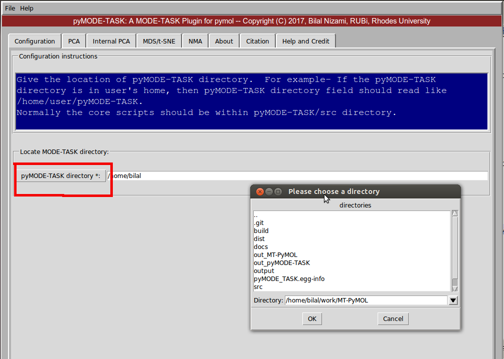

   Fig: Set pyMODE-TASK directory
   
3. It should look something like this

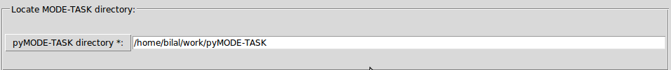

   Fig: Set pyMODE-TASK directory
	
4. Next go to the PCA tab. Read the trajectory, topology and reference PDB by clicking on the respective
buttons. Next select the appropriate options and click on Run PCA. The results file will be saved in a folder
within the output directory. 

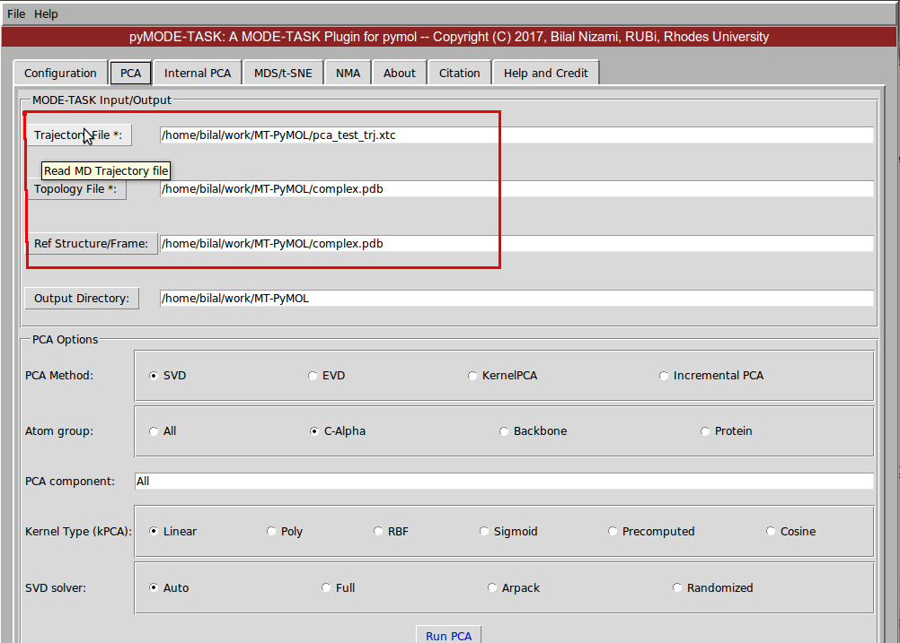

   Fig: PCA 
   
5. If the run is successful you will see something like following

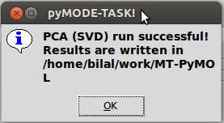

   Fig: PCA successful 
   
MDS and t-SNE
-------------------------------

1. Read the trajectory, topology files by clicking on the respective buttons. Select the appropriate options 
under MDS options widget and click on Run MDS.

2. Similarly, run the t-SNE.

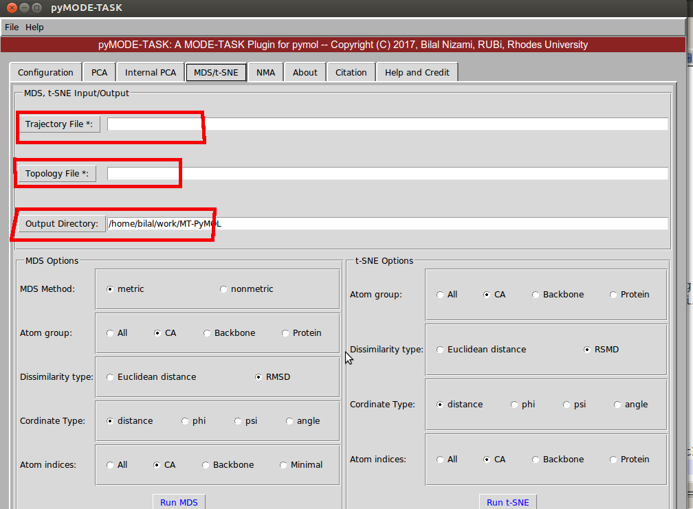

   Fig: MDS and t-SNE 
   
   
Normal mode analysis (NMA)
-------------------------------

1. Set the configuration page to locate the pyMODE-TASK directory.

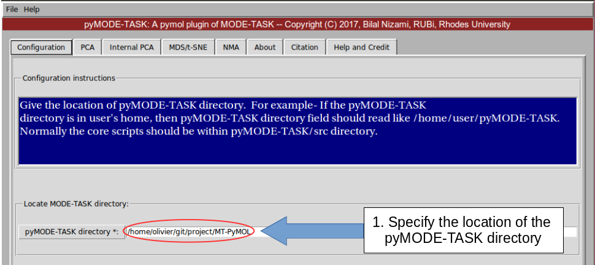

   Fig: NMA set configuration

2. Perform the coarse graining for large protein molecules.

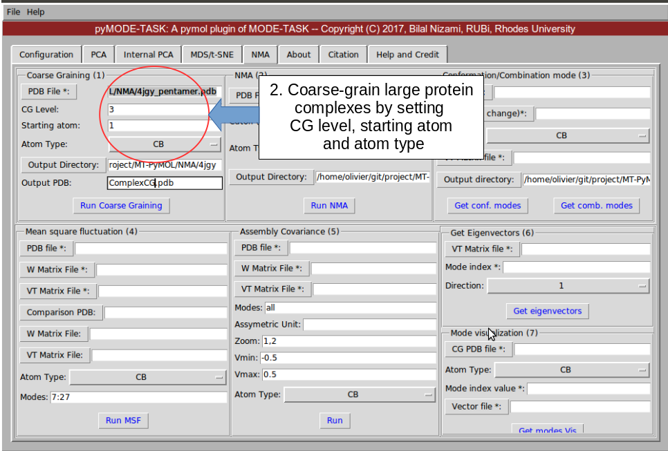

   Fig: Coarse graining
   
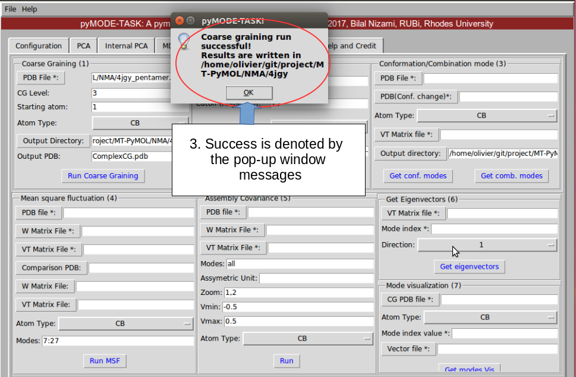

   Fig: Coarse graining results
   
3. Perform the coarse graining for second conformation of the protein. 
This is useful in case if you want to perform "Conformation/ Combination tool analysis" and 
"Mean square fluctuation". 

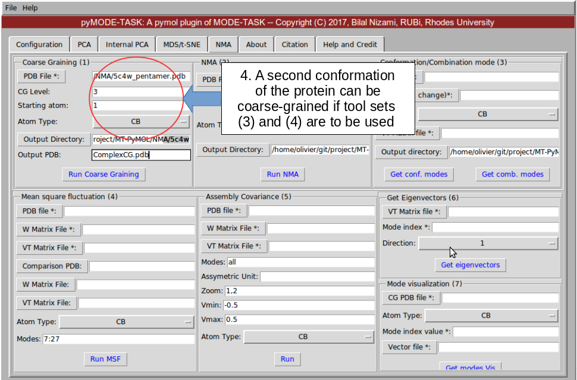

   Fig: Coarse graining 2
   
4. Run NMA on each coarse grained PDB using a suitable cutoff. 
 
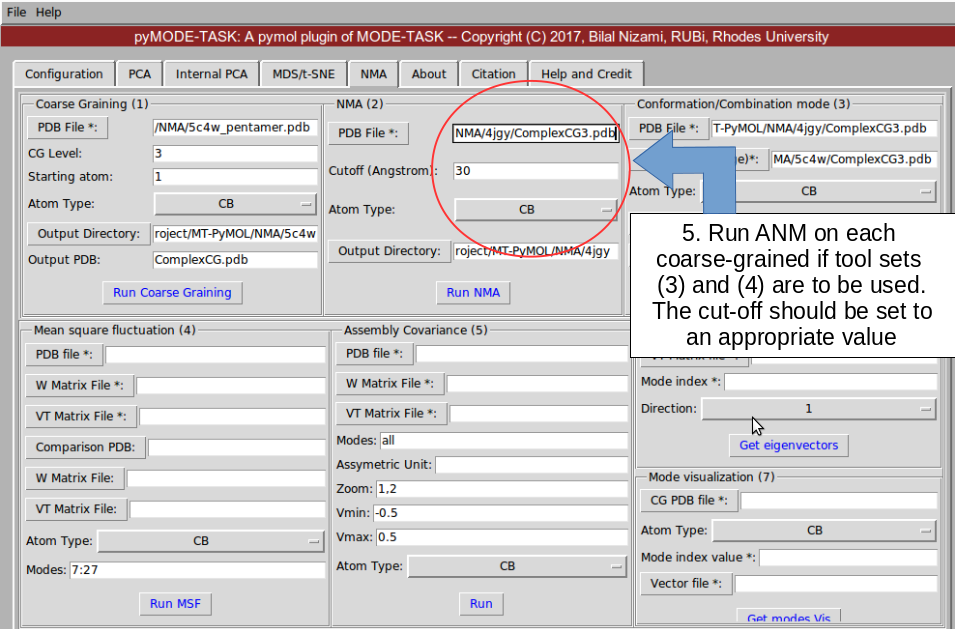

   Fig: NMA for first PDB

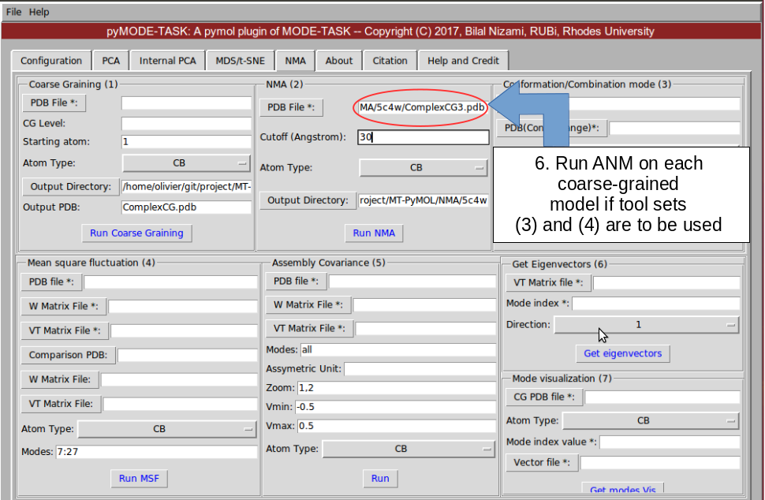

   Fig: NMA for second PDB
   
5. Run conformation / combination mode analysis. This require two PDB of different conformation.

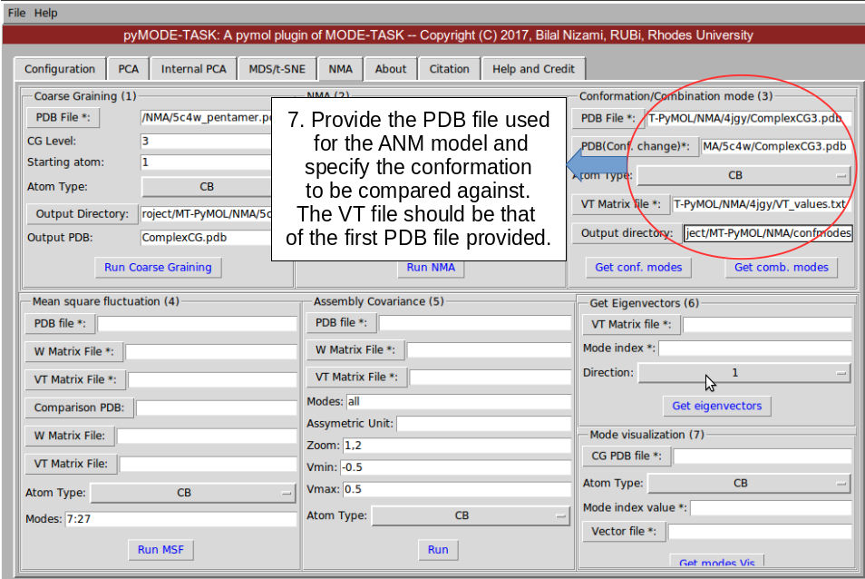

   Fig: conformation/combination mode analysis
   
6. Run MSF. This requires decomposed ANM matrices for comparing the mean square fluctuation between 2 proteins. 

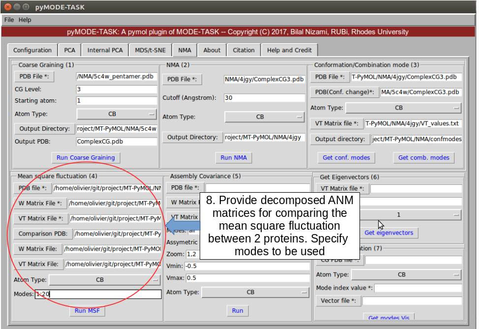

   Fig: MSF

8. Get an assembly covariance for a specified chain of an asymmetric unit

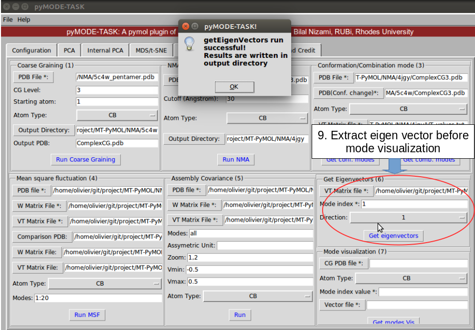

   Fig: Get Eigenvectors
   
9. Generate mode animation for visualization. Afterward use the following command in VMD for visualization

::
	
   vmd VISUALISE/VISUAL_1.pdb -e VISUALISE/VISUAL_ARROWS_1.txt

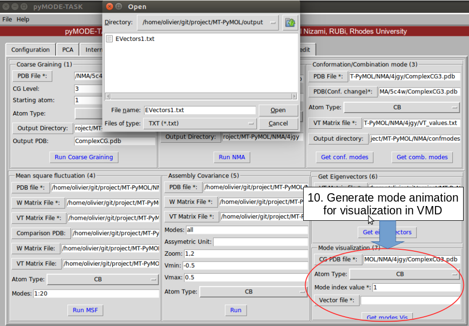

   Fig: Mode animation

 
    
